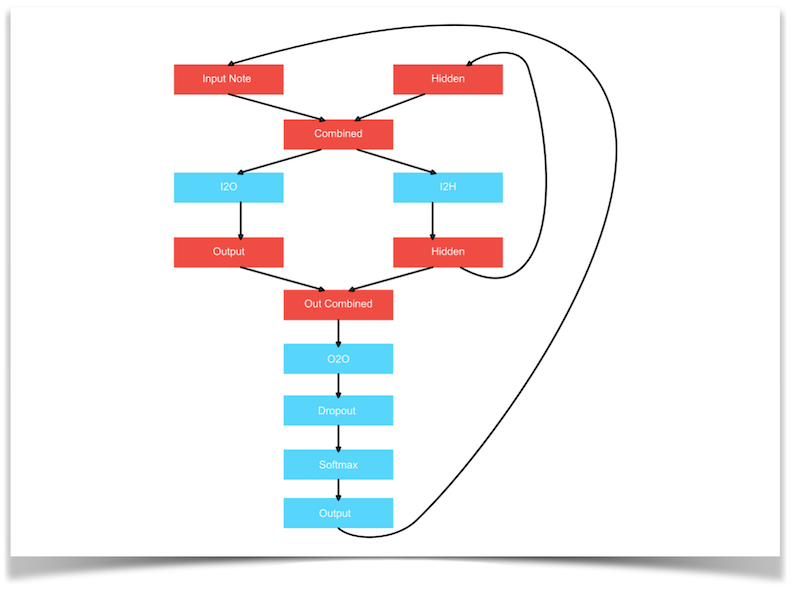
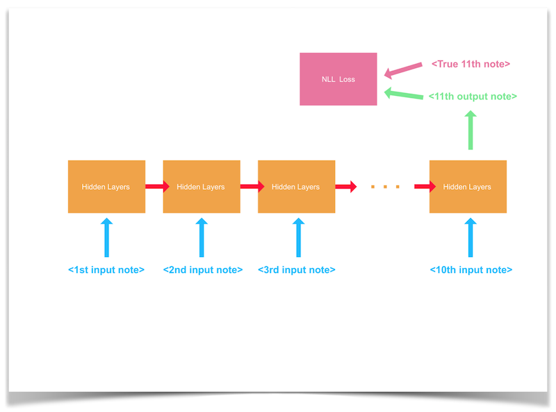
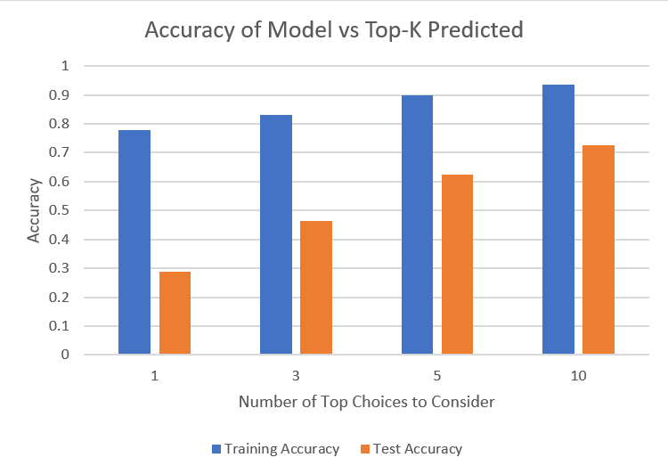
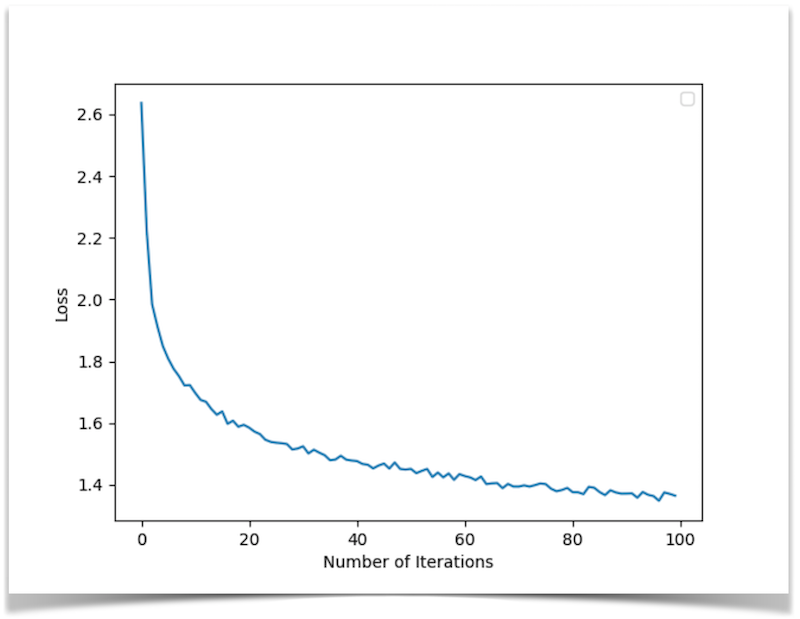
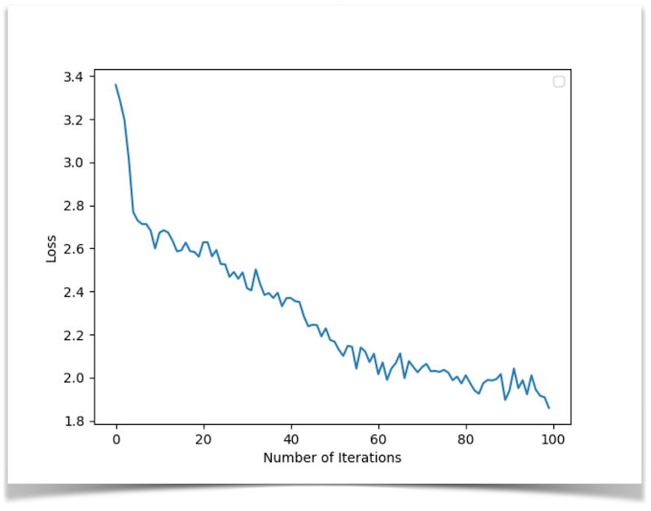
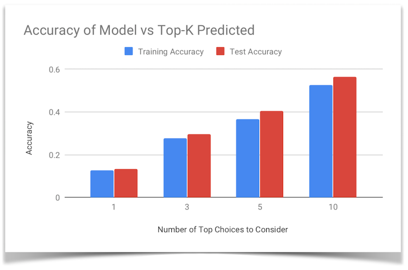
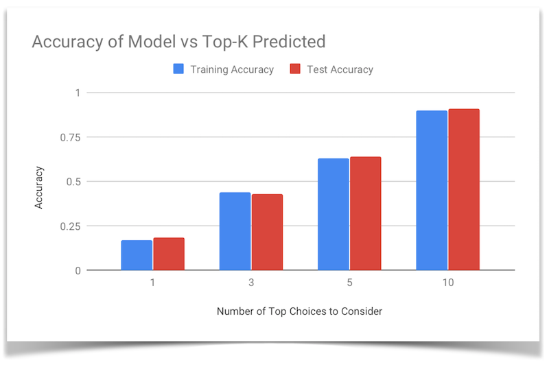
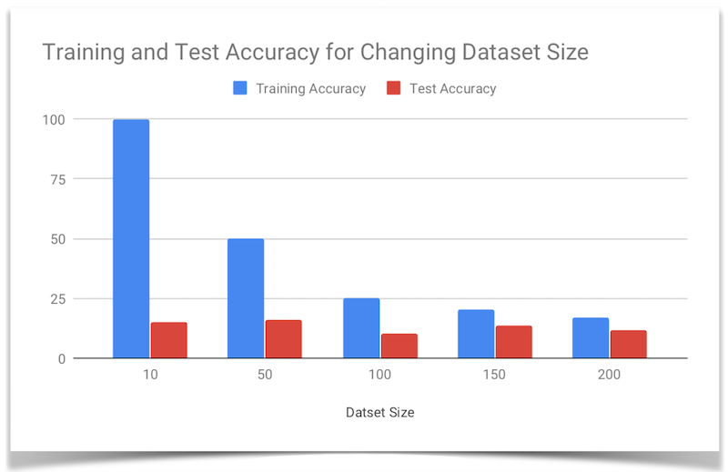

## Status Video
------------------

## Project Summary
------------------
The purpose of this project is to create a model that, given music as training data, can recreate music of the same genre given a musical start (around 10 notes). The type of music generated will depend largely on the type of music trained on. For example a model trained on Bach will yield Bach-esque results, while other models might have different characteristics. Once this music is generated, we then use Malmo to create a series of note blocks that the agent can play in order to play the music on the Minecraft platform. With the final result of this project, our model can recreate music that is similar to the trained music, with a fair degree of musicality.
  
A baseline that we seeked to improve on was simply picking notes at random in order to recreate music. Since such a model would have no sense of what might make sense with a given context, a ML component was necessary in order to adapt the model to the pleasing combinations of notes. By doing so, our model was better able to anticipate which notes would be logical to play next, drawing inspiration entirely from the previous notes that it has seen.

## Approaches
-------------

### Baselines
-------------
In the beginning of the project, we used a model that selects notes in a completely random manner, from any possible note. However, we realized that this was not a very fair comparison, as there was a huge disparity in the notes being selected, and there was no reasonable way for the notes to sound musical. Thus since we start the song with the first ten notes of the original song, we only selected random notes out of the pool of notes that we already saw in that ten-note intro. By doing this, we saw a slight improvement in the baseline, though it still sounded far worse than our own finalized model, which is good.

### Random Forest
-----------------
The Random Forest was the model that we began with, and it turned out to be the model that we had the most success with. The way we set up the model was in a "sliding window" type of sampling. We began the model with the first ten notes of a song, and used those ten notes to predict the next note. Once that note is predicted, we then drop the first note, append the new note to the end, and repeat the process with our new ten-note sample. Since the model was so simplified, it was easy to prototype changes to the model and test them rapidly. However, while this model gave us the most consistently pleasing results, it did have some drawbacks. Since the model was merely a number of decision trees, it does not have the capability to track long-term patterns in the music, and relies solely on the previous ten notes to determine the new note. Something like a Recurrent Neural Network (RNN) might work better for this purpose, but the RNN that we tried sounded worse than the Random Forest in our testing.

### Recurrent Neural Network
----------------------------

To be able to compare the performance of the Random Forest classifier described above, we decided to add in a different model called a recurrent neural network. 
  
We used two different ways of training our RNN, and we report accuracy scores for both ways in the sections below. Before we go into this, let’s first look at the general architecture we used for our RNN, shown in the diagram below: 

#### Note Representation
To represent our pitches, we chose a one-hot vector representation where for example a 1 in position 8 means the song is currently playing the 8th pitch in our vocabulary of pitches. The length of the one-hot vectors is equal to 33, the total number of classes (pitches) we can possibly predict. 

#### Training by notes
To be able to train by notes, we perform stochastic gradient descent by picking one song at random from the dataset, then going through every note, and predicting the next one. More specifically, we first send the first note through the network, predict the second note and compute the loss. Then we send the second note into the network (and carry over the hidden state), and predict the third note. We keep following this procedure until the end of the song.
  
Initially when training our RNN, we encountered a problem known as “exploding gradients”. Initially, we decreased the learning rate to prevent this problem, but loss convergence would then be very slow. Therefore, we used the solution proposed in [this paper](https://arxiv.org/abs/1211.5063), which advocates for gradient norm clipping. 

After some testing and playing around with different hyper parameters and training configurations, we decided on the following values:
* Learning Rate: 0.0005
* Iterations: 100,000
* Dataset size: 200
* Gradient clipping: 100

We also note that training the RNN by notes took much longer than training by sequences of notes (described below), as we have to do less forward passes through the network per iteration. 

#### Training by sequences
When training by sequences of notes, we performed stochastic gradient descent by picking a sequence of 10 notes from our dataset and predicting the one that comes after (the 11th note). The following diagram presents a visualization of this: 

For our hyper parameters and training configuration values, we used the following: 
* Learning Rate: 0.0005
* Iterations: 100,000
* Dataset size: 200
* Gradient clipping: 20

We tested out different gradient clipping values, and for training sequences of notes a lower clipping value was used to make the decrease of the loss slightly smoother (but also a little slower) and to be able to reach a slightly lower final loss value. 
  
As mentioned in the previous section, this way of training the RNN went significantly faster, as we only have to do 11 passes through the network for each sample of the dataset, whereas earlier we had to pass every note in the song minus one. 
  
To conclude this section, let’s look at some advantages and disadvantages of RNNs. 

#### Advantages
The main advantage of using a RNN would be that it is supposed to be able to capture more music dependencies, such as local coherences, pitch variations, etc. However, due to difficulties we have encountered as described above, unfortunately we have not been able to enjoy the full power of RNNs. 

#### Disadvantages
We have found several disadvantages to using RNNs. Firstly, in our experiences, they were much harder to train than our other classifiers. For the RNN, there is not one perfect architecture that always works, and experimenting with other more expressive architectures is one possible way our results could have been improved. Furthermore, it is not as straightforward to process all information in training. We had to make sure we passed the hidden state correctly to the next time sequence, read the output at the right time, etc. Finally, we also experienced that RNNs take longer to train, are less accurate (see evaluation), and less musical for our current task of generating music.

### SVM and other models
------------------------

## Evaluation
-------------

### Random Forest
-----------------
In the first iteration of this project, for the evaluation function, we simply took a ten-note start of a song and predicted it as we would normally. Then, using a hit or miss strategy, if the note was identical to the expected note, the model would gain a point, and if it was not identical, the model would not gain a point. However, this mode of evaluation was lacking, as it is possible that the second most likely choice would be the correct note for the situation, and the evaluation is simply skipping it since it is not the dominant decision. Thus for this next iteration, we focused on relaxing this very strict "hit/miss" criteria, and checking the less likely options of the model as well to ensure that the correct note was not just "hiding" behind the more likely note. 
  
Thus, we also tested the accuracy of the model when the top K choices are consided, with the tested Ks being 1, 3, 5, and 10. As expected, when we relax this criteria, the model's accuracy improves, and we see a closer resemblance to the original song.

  
By looking at this graph, we can see that we were indeed getting a reasonably accurate prediction for our randomly chosen song.

### Recurrent Neural Network
----------------------------
In the plots below, we show the loss graph for both training approaches. 

#### Loss convergence when training by notes

#### Loss convergence when training by sequences

Additionally, we show the varying hit accuracies of the RNN for both ways of training, for a dataset size of 200 songs.

#### Training by notes

#### Training by sequences

 
Additionally, we would like to note that both the RNN trained on notes and the Random Forest were able to learn one song with a 100% training accuracy, but for the RNN trained on notes we noted that the training accuracy dropped significantly as the dataset size grew: 
 

## References
-----------------
- [Music21](https://web.mit.edu/music21/) : Python library to facillitate note and midi parsing
- [Malmo XML Documentation](https://microsoft.github.io/malmo/0.30.0/Schemas/Types.html) : helpful for learning about the formatting of XML mission strings
- [scikit learn](https://scikit-learn.org/stable/) : Python library to handle much of the ML components
- [Karpathy article about RNNs](http://karpathy.github.io/2015/05/21/rnn-effectiveness/) : article describing the effectiveness of RNNs on a variety of applications
- [PyTorch Char RNN Tutorial](https://pytorch.org/tutorials/intermediate/char_rnn_generation_tutorial.html) : article we based the architecture of our RNN on
- [Generating Sound with RNNs](http://www.johnglover.net/blog/generating-sound-with-rnns.html) : example of someone working on a similar problem, useful to see their approach
- [Sound RNN](https://github.com/jfsantos/sound-rnn) : Another example of RNN to produce sound 
- [Performance RNN](https://magenta.tensorflow.org/performance-rnn) : One of Google's Magenta high performing RNN models
- [RNN Generation Tutorial](https://magenta.tensorflow.org/2016/06/10/recurrent-neural-network-generation-tutorial) : Tutorial by Google to show a simple melody RNN
- [Encoder for Melody RNN](https://github.com/tensorflow/magenta/blob/master/magenta/music/melody_encoder_decoder.py) : encoder used for Magenta Melody RNN
- [Magenta Constants File](https://github.com/tensorflow/magenta/blob/master/magenta/music/constants.py) : Constants used in Google's Magenta Project
- [Composing Music with RNNs](http://www.hexahedria.com/2015/08/03/composing-music-with-recurrent-neural-networks/) : yet another example of composing music with RNNs
- [Gradient Clipping](https://machinelearningmastery.com/how-to-avoid-exploding-gradients-in-neural-networks-with-gradient-clipping/) : article that discuss gradient clipping, its applications, and where it came from 
- [On the difficulty of training Recurrent Neural Networks](https://arxiv.org/abs/1211.5063) : paper that talks about the exploding gradient problem, as well as how to solve it  
